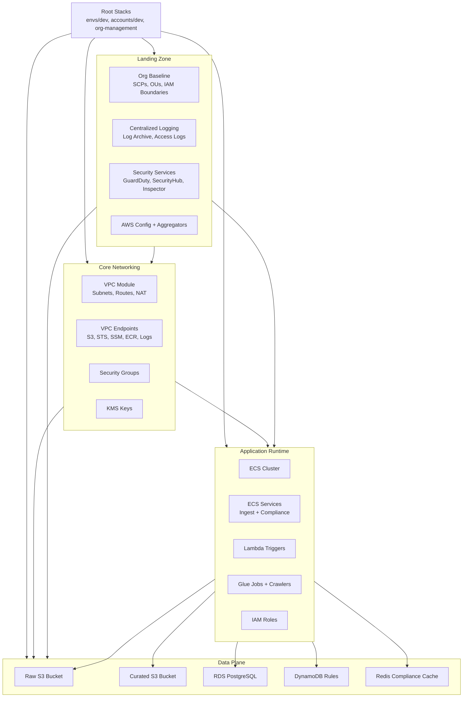

# Healthcare Event Stream Platform — IaC Architecture

## 1. Purpose
The Infrastructure‑as‑Code (IaC) architecture defines how the Healthcare Event Stream Platform (HESP) is provisioned, governed, and deployed. It provides a modular, reusable Terraform foundation that enables teams to onboard new ingestion workloads, compliance services, and data pipelines using consistent patterns and guardrails.

The IaC model ensures that every environment is secure, reproducible, and aligned with enterprise governance and HIPAA requirements.

---

## 2. Terraform Architecture Overview

### 2.1 High‑Level IaC Architecture Diagram

---

## 3. Module Overviews & Guardrails

This section explains **what each module does**, **why it exists**, and **which guardrails it enforces**.  
This is the “developer‑facing map” of the IaC system.

---

### 3.1 Core Landing Zone Modules

#### **VPC Module**
**Purpose:**  
Creates the network foundation for all workloads.

**Provides:**  
- public, private, isolated subnets  
- NAT gateways  
- route tables  
- subnet tagging for EKS/ECS/Lambda compatibility  

**Guardrails:**  
- PHI isolation via private subnets  
- no public IP assignment  
- VPC Flow Logs enabled (paved road)  
- restricted default SG  

**Paved Road:**  
All workloads must deploy into **private subnets** and use **VPC endpoints** for AWS APIs.

---

#### **VPC Endpoints Module**
**Purpose:**  
Private connectivity to AWS services.

**Provides:**  
- S3, STS, SSM, ECR, Logs, Secrets Manager endpoints  
- endpoint security groups  

**Guardrails:**  
- no internet egress required  
- PHI never leaves AWS backbone  
- SGs restrict inbound/outbound traffic  

**Paved Road:**  
All ECS, Lambda, and Glue workloads must use endpoints for AWS API calls.

---

#### **Security Groups Module**
**Purpose:**  
Defines least‑privilege network boundaries.

**Guardrails:**  
- no 0.0.0.0/0 ingress  
- restricted egress  
- mandatory SG descriptions  
- PHI‑aware segmentation  

**Paved Road:**  
Workloads must use module‑provided SGs rather than creating their own.

---

#### **KMS Module**
**Purpose:**  
Centralized encryption for all data stores.

**Guardrails:**  
- CMK rotation enabled  
- no wildcard principals  
- enforced encryption for S3, RDS, DynamoDB, Lambda, CloudWatch  

**Paved Road:**  
All modules accept a `kms_key_id` input and must use it.

---

### 3.2 Governance & Security Modules

#### **AWS Config Module**
**Purpose:**  
Detects drift and enforces configuration rules.

**Guardrails:**  
- required tags  
- encryption required  
- public access blocked  
- IAM least privilege  

**Paved Road:**  
All resources must be compliant with Config rules before deployment.

---

#### **CloudTrail Module**
**Purpose:**  
Captures all API activity.

**Guardrails:**  
- immutable audit logs  
- centralized log archive  
- multi‑region trails  

**Paved Road:**  
All accounts forward CloudTrail to the org‑level log archive.

---

#### **Security Hub Module**
**Purpose:**  
Centralized security posture management.

**Guardrails:**  
- CIS AWS Foundations  
- PCI DSS  
- HIPAA Security Rule  

**Paved Road:**  
All accounts auto‑enroll and forward findings to the admin account.

---

#### **GuardDuty Module**
**Purpose:**  
Threat detection and anomaly monitoring.

**Guardrails:**  
- organization‑wide GuardDuty  
- S3 protection  
- EKS/ECS runtime monitoring  

---

#### **Inspector Module**
**Purpose:**  
Vulnerability scanning for workloads.

**Guardrails:**  
- EC2 scanning  
- Lambda scanning  
- ECR image scanning  

---

#### **SCP Baseline Module**
**Purpose:**  
Organization‑wide guardrails.

**Guardrails:**  
- deny public S3  
- deny IAM wildcard  
- deny unencrypted resources  
- deny internet‑facing RDS  
- deny disabling CloudTrail/Config  

**Paved Road:**  
Workloads must operate within SCP boundaries.

---

### 3.3 Data Plane Modules

#### **S3 Buckets Module**
**Purpose:**  
Durable storage for raw and curated events.

**Guardrails:**  
- versioning  
- encryption  
- block public access  
- lifecycle policies  
- access logging  
- replication (optional)  

**Paved Road:**  
All ingestion workloads write to the **raw** bucket;  
all compliance workloads write to the **curated** bucket.

---

#### **RDS PostgreSQL Module**
**Purpose:**  
Stores compliance metadata and lineage.

**Guardrails:**  
- encryption at rest  
- encryption in transit  
- IAM auth  
- deletion protection  
- multi‑AZ  
- performance insights  
- enhanced monitoring  

---

#### **DynamoDB Compliance Rules Module**
**Purpose:**  
Stores rule definitions and evaluation metadata.

**Guardrails:**  
- PITR enabled  
- CMK encryption  
- no public access  

---

#### **Redis Compliance Cache Module**
**Purpose:**  
Low‑latency rule evaluation cache.

**Guardrails:**  
- encryption at rest  
- encryption in transit  
- auth token required  
- subnet isolation  

---

### 3.4 Application Runtime Modules

#### **ECS Cluster Module**
**Purpose:**  
Runs ingestion and compliance services.

**Guardrails:**  
- Fargate only  
- no public IPs  
- exec logging enabled  
- container insights enabled  

---

#### **ECS Service Module**
**Purpose:**  
Deploys ingestion + compliance workloads.

**Guardrails:**  
- read‑only root FS  
- non‑privileged containers  
- health checks required  
- HTTPS‑only ALB  
- no host networking  

---

#### **Lambda Trigger Module**
**Purpose:**  
Event‑driven ingestion and replay triggers.

**Guardrails:**  
- VPC‑only  
- DLQ required  
- env var encryption  
- concurrency limits  
- code signing  

---

#### **Glue Job & Crawler Modules**
**Purpose:**  
Schema discovery and batch transformations.

**Guardrails:**  
- Glue security configuration required  
- CMK encryption  
- CloudWatch log encryption  

---

## 4. CI/CD Workflow & Deployment Safety

### 4.1 Workflow Overview
The CI/CD pipeline performs:

1. static validation (fmt, validate, lint)  
2. Terraform plan with drift detection  
3. policy checks (OPA, Checkov, Sentinel)  
4. controlled apply  
5. post‑deployment verification (health checks + SLO checks)  

All changes are version‑controlled and auditable.

---

### 4.2 Safe Deployment Controls
The platform enforces:

- rolling or blue/green deployments  
- ALB health‑check gates  
- dependency health checks (RDS, Redis, DynamoDB, S3)  
- trace and metric‑based verification  
- canary rollout stages  

Deployments cannot progress if any gate fails.

---

### 4.3 Automated Rollback
Rollback is triggered automatically when:

- error rates exceed thresholds  
- ingestion or compliance failures spike  
- S3 or RDS latency violates SLOs  
- health checks fail during rollout  
- dependency availability degrades  

Rollback protects PHI integrity and minimizes blast radius.

---

### 4.4 Immutable Infrastructure
All infrastructure is:

- declarative  
- versioned  
- reproducible  
- environment‑scoped  

No manual changes are permitted in production environments.

---

## 5. Developer Reuse & Extensibility

### 5.1 Reusable Modules
Teams can reuse modules for:

- new ingestion services  
- new compliance engines  
- new data pipelines  
- new S3 landing zones  
- new RDS or DynamoDB stores  

Modules enforce consistent patterns and governance.

---

### 5.2 Environment Parity
The same IaC stack deploys:

- dev  
- staging  
- production  

This ensures consistent behavior across environments.

---

### 5.3 Extensible Architecture
New capabilities can be added by:

- composing existing modules  
- creating new modules following platform patterns  
- extending the data plane  
- adding new event types or workflows  

The IaC model supports long‑term platform evolution.

---

## 6. Outcomes

- secure, governed, HIPAA‑aligned infrastructure  
- reusable Terraform modules for rapid onboarding  
- safe, observable, rollback‑enabled deployments  
- consistent environments across the enterprise  
- strong PHI boundaries and auditability  
- scalable foundation for future healthcare workloads  
