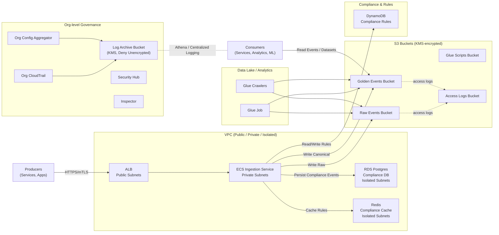

```md
# AcmeCo Event Stream Platform — Architecture Diagram


```mermaid
flowchart LR
    subgraph Network["VPC (Public / Private / Isolated)"]
      ALB["ALB\nPublic Subnets"]
      ECS["ECS Ingestion Service\nPrivate Subnets"]
      RDS["RDS Postgres\nCompliance DB\nIsolated Subnets"]
      REDIS["Redis\nCompliance Cache\nIsolated Subnets"]
    end

    subgraph S3Buckets["S3 Buckets (KMS-encrypted)"]
      RAW["Raw Events Bucket"]
      GOLDEN["Golden Events Bucket"]
      SCRIPTS["Glue Scripts Bucket"]
      ACCESS["Access Logs Bucket"]
    end

    subgraph DataLake["Data Lake / Analytics"]
      GLUE["Glue Job"]
      CRAWLERS["Glue Crawlers"]
    end

    subgraph Compliance["Compliance & Rules"]
      DDB["DynamoDB\nCompliance Rules"]
      RDS
      REDIS
    end

    subgraph OrgLevel["Org-level Governance"]
      ORGTRAIL["Org CloudTrail"]
      ORGCONFIG["Org Config Aggregator"]
      LOGARCH["Log Archive Bucket\n(KMS, Deny Unencrypted)"]
      SECHUB["Security Hub"]
      INSPECTOR["Inspector"]
    end

    PRODUCER["Producers\n(Services, Apps)"]
    CONSUMER["Consumers\n(Services, Analytics, ML)"]

    PRODUCER -->|"HTTPS/mTLS"| ALB --> ECS

    ECS -->|"Write Raw"| RAW
    ECS -->|"Write Canonical"| GOLDEN
    ECS -->|"Read/Write Rules"| DDB
    ECS -->|"Cache Rules"| REDIS
    ECS -->|"Persist Compliance Events"| RDS

    GLUE --> RAW
    GLUE --> GOLDEN
    CRAWLERS --> RAW
    CRAWLERS --> GOLDEN

    CONSUMER -->|"Read Events / Datasets"| GOLDEN

    ORGTRAIL --> LOGARCH
    ORGCONFIG --> LOGARCH

    RAW -. access logs .-> ACCESS
    GOLDEN -. access logs .-> ACCESS

    LOGARCH -. Athena / Centralized Logging .- CONSUMER
```
```
